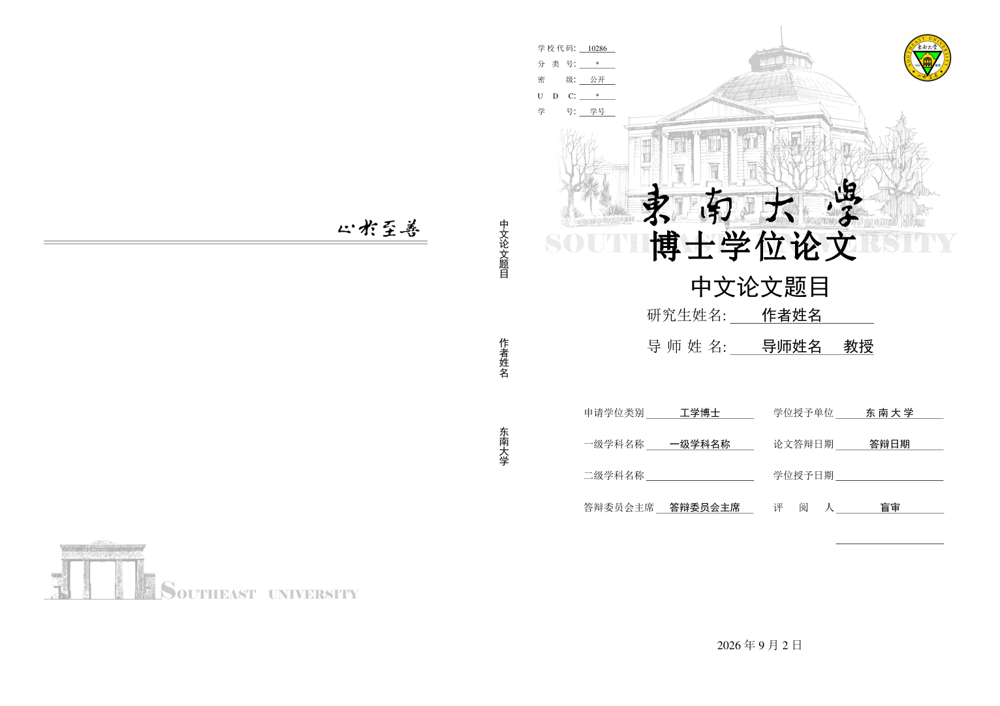

# 东南大学博士论文LaTeX模板
本项目是东南大学博士论文LaTeX模板，包含完整的博士论文格式、排版、以及东南大学研究生学位论文格式规定，写于2026年9月。

<p align="center">

</p>

## 目录结构
```text
sample_phd.tex          主文件
sample_phd.pdf          博士论文pdf
figure/                 博士论文图像库
tex/                    博士论文内容文件
  terms.tex             缩略词表
  chapter01_introduction.tex       绪论
  chapter02_related_work.tex       相关理论与技术基础
  chapter03_research_content_1.tex 研究内容一
  chapter04_research_content_2.tex 研究内容二
  chapter05_research_content_3.tex 研究内容三
  chapter06_conclusion.tex         总结与展望
  acknowledgement.tex   致谢
references.bib          参考文献库
东南大学研究生学位论文格式规定.pdf
template_figures/       封面和校徽等模板资源
seuthesix.cls           东南大学论文类文件
seuthesix.cfg           模板配置文件
seuthesix.bst           参考文献样式
```

## 使用说明
1. 在 `sample_phd.tex` 中填写题目、作者、导师、学科、答辩日期等基本信息。
2. 在 `tex/` 目录中分别撰写各章节内容。
3. 在 `references.bib` 中维护参考文献。
4. 将正文图像放入 `figure/` 目录，并在章节中使用 `\includegraphics` 调用。
5. 编译方式，推荐使用 XeLaTeX 编译，对主文件`sample_phd.tex`进行编译。

## 总结
坚持就是胜利！亲测该模板顺利通过盲审3A和答辩。

⭐点个Star让下一个焦虑的博士生找到它。

## 致谢
本模板感谢东南大学毕业的Dr.Yuan Zhang, Dr.Yuting He, Dr.Xinyu Wu.

